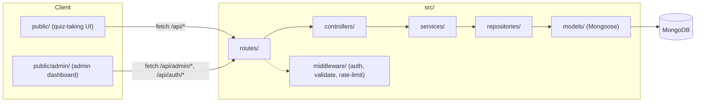

# Quiz App — Technical Documentation

Node.js/Express quiz application with a MongoDB (Mongoose) backend, JWT-based
auth, and a plain HTML/JS admin dashboard. This document is a self-contained
reference for continuing development without AI assistance.

## 1. Stack & requirements

- Node.js (uses `node --watch` for dev reload, so Node 18.11+/20+ recommended)
- MongoDB (via `mongoose`)
- Key dependencies: `express`, `mongoose`, `joi` (validation), `passport` +
  `passport-local` (auth strategy), `jsonwebtoken` (JWT), `bcryptjs` (password
  hashing), `express-rate-limit`, `dotenv`.

### Environment variables (`.env` in `version1/`)

| Variable | Required | Notes |
|---|---|---|
| `MONGODB_URI` | yes | No DB name segment in the current `.env` → Mongo defaults to the `test` database. Atlas browsing must target `test.questions`, `test.users`, etc. |
| `JWT_SECRET` | yes | Used to sign/verify JWTs (`src/services/auth.service.js`). Missing value throws at login/token-verify time. |
| `JWT_EXPIRES_IN` | no | Defaults to `1h`. |
| `PORT` | no | Defaults to `3000`. |

### Scripts (`package.json`)

```bash
npm install
npm start              # node src/server.js
npm run dev             # node --watch src/server.js (auto-reload)
npm run seed             # wipes Question collection, inserts sample questions
npm run create-admin -- <email> <password> [admin|superuser]
npm test                 # node --test (no test files exist yet)
```

`create-admin` upserts a user by email. The `role` argument is **optional**
and only applied if explicitly passed — omitting it on an existing user
preserves their current role (new users default to `admin` if omitted).

## 2. High-level architecture



Layering is strict: `routes → controllers → services/repositories → models`.
Controllers talk to repositories directly for simple CRUD (questions, banks,
submissions, users); `services/` hold actual business logic (auth token
issuance, quiz scoring, bulk import parsing, user creation with duplicate
checks).

### Entry points

- `src/server.js` — connects to Mongo (`config/db.js`) then starts the HTTP
  listener.
- `src/app.js` — builds the Express app: JSON body parsing, serves
  `public/` as static files, and mounts routers:
  - `/api` → `routes/quiz.routes.js` (public quiz-taking)
  - `/api/auth` → `routes/auth.routes.js` (login)
  - `/api/admin` → `routes/admin.routes.js` (questions, banks, submissions)
  - `/api/admin/users` → `routes/user.routes.js` (superuser user management)
  - global `errorHandler` middleware last

## 3. Auth & roles

- **Strategy**: Passport local strategy (`src/auth/localStrategy.js`) checks
  `email` + `password` against `User` documents where `authProvider: 'local'`,
  using bcrypt. `src/auth/passport.js` registers strategies — designed so an
  OIDC/SSO strategy can be added later **without** touching `authenticate`/
  `authorize` middleware or route code.
- **Tokens**: `POST /api/auth/login` issues a JWT (`auth.service.js`) with
  payload `{ sub, email, role }`. All protected routes require
  `Authorization: Bearer <token>`, verified by
  `src/middleware/authenticate.js`, which attaches the decoded payload to
  `req.user`.
- **Authorization**: `src/middleware/authorize.js` is a role gate
  (`authorize(ROLES.ADMIN, ROLES.SUPERUSER)`), applied per-router after
  `authenticate`.
- **Roles** (`src/constants/roles.js`):
  - `superuser` — full access to all questions/banks regardless of owner;
    only role that can manage users (`/api/admin/users`).
  - `admin` — can manage only questions/banks they created (`createdBy`
    ownership check via `canModify()` in `admin.controller.js`).
  - `user` — default role, no admin API access; can only hit the public
    `/api/questions` and `/api/submit` endpoints (these routes don't even
    require authentication currently).

## 4. Data models (`src/models/`)

### `Question` (discriminated by `type`)

Base schema (`discriminatorKey: 'type'`):
```js
{
  question: String,               // required
  createdBy: ObjectId (User),      // owner, used for admin-role scoping
  questionBank: ObjectId (QuestionBank) | null
}
```

Discriminators:

| type | extra fields |
|---|---|
| `multiple-choice` | `options: [String]` (≥2), `correctIndex: Number` (valid index into `options`) |
| `true-false` | `correctAnswer: Boolean` |
| `multi-select` | `options: [String]` (≥2), `correctIndexes: [Number]` (≥1, all valid indexes) |
| `short-answer` | `correctAnswer: String`, `caseSensitive: Boolean` (default `false`) |

`QUESTION_TYPES` constants map to these string values and are exported from
the model file.

### `QuestionBank`
```js
{ name: String (required, trimmed), createdBy: ObjectId (User, required), timestamps: true }
```
Question banks are purely a grouping/label for questions. Deleting a bank
does **not** delete its questions — `questionRepository.clearQuestionBank()`
sets their `questionBank` to `null` first (they become "unbanked"), then the
bank document is deleted.

### `User`
```js
{
  email: String (required, unique, lowercase),
  passwordHash: String,           // only set when authProvider === 'local'
  role: 'user' | 'admin' | 'superuser' (default 'user'),
  authProvider: 'local' | 'sso' (default 'local'),
  providerId: String              // reserved for future SSO subject id
}
```

### `Submission`
```js
{
  score: Number, total: Number,
  results: [{ questionId: ObjectId (Question), correct: Boolean }],
  submittedAt: Date (default now)
}
```
Submissions are currently **anonymous** — there's no `userId` field linking a
submission to the person who took the quiz.

## 5. API reference

All admin (`/api/admin/*`) and user-management (`/api/admin/users/*`) routes
require `Authorization: Bearer <jwt>` and the appropriate role. Request bodies
are validated with Joi (`src/validators/`); failures return
`400 { error: 'Validation failed', details: [...] }` unless noted otherwise.

### Public / quiz-taking (`src/routes/quiz.routes.js`) — no auth required

- `GET /api/questions` — rate-limited (100/15min). Returns **all** questions
  in the DB (not scoped by owner or bank) with the answer key stripped
  (`quiz.service.sanitizeQuestion`). True/false questions get synthetic
  `options: ['True', 'False']`.
- `POST /api/submit` — rate-limited (20/15min). Body: `{ answers: { [questionId]: <value> } }`
  where `<value>` shape depends on question type (option index, boolean,
  array of indexes, or string). Scores against **all** questions in the DB,
  stores a `Submission`, and returns `{ score, total, results }`.

  > Note: this endpoint has no concept of "which quiz"/bank the user is
  > taking — it always scores against every question in the collection. If
  > you need bank-scoped quizzes, this is the place to add a `questionBank`
  > query param/body field and filter accordingly.

### Auth (`src/routes/auth.routes.js`)

- `POST /api/auth/login` — body `{ email, password }` → `{ token, user: { id, email, role } }`. 401 on bad credentials.
- `GET /api/auth/me` — requires auth → `{ user: { sub, email, role } }` (decoded JWT payload, not a fresh DB read).

### Admin: Questions (`src/routes/admin.routes.js`) — role `admin`/`superuser`

- `GET /api/admin/questions` — superusers get all questions (with
  `createdBy` populated to `{ email }`); admins get only their own.
- `POST /api/admin/questions` — body validated by `questionSchema`
  (`src/validators/question.validators.js`); `type`-conditional fields (see
  table above). Optional `questionBank` (24-char hex ObjectId or `null`) is
  checked for existence + ownership before creating.
- `PUT /api/admin/questions/:id` — same body schema; 404 if not found, 403 if
  not owned (unless superuser).
- `DELETE /api/admin/questions/:id` — 404/403 same as above.
- `POST /api/admin/questions/import` — **bulk import**, see §6 below.

### Admin: Question Banks

- `GET /api/admin/question-banks` — scoped like questions (all for
  superuser, own-only for admin); superuser responses include
  `createdBy: { email }`.
- `POST /api/admin/question-banks` — body `{ name }` (`questionBankSchema`).
- `PUT /api/admin/question-banks/:id` — same body; ownership-checked.
- `DELETE /api/admin/question-banks/:id` — unbanks associated questions
  first (see model section), then deletes.

### Admin: Submissions (read-only)

- `GET /api/admin/submissions` — all submissions (not owner-scoped; there's
  no owner concept on submissions currently).
- `GET /api/admin/submissions/:id` — single submission, 404 if missing.

### Admin: Users — role `superuser` only (`src/routes/user.routes.js`, mounted at `/api/admin/users`)

- `GET /api/admin/users` — all users, `passwordHash` excluded.
- `POST /api/admin/users` — body `{ email, password (min 8), role: 'admin'|'superuser' }`
  (`createUserSchema`); 409 if email already exists.
- `DELETE /api/admin/users/:id` — 400 if attempting to delete your own
  account; 404 if not found.

## 6. Bulk question import

Endpoint: `POST /api/admin/questions/import`
Body: `{ text: string, questionBank?: string|null }` (`questionImportSchema`).
Parsing/validation logic lives in `src/services/questionImport.service.js`
(pure functions, no DB access — easy to unit test in isolation). Bank name
resolution and DB writes happen in
`bulkImportQuestions` (`src/controllers/admin.controller.js`).

### Text format

```
[MultipleChoice]
What is the capital of France?
*Paris
London
Berlin
Madrid

[TrueFalse]
The Earth is flat.
*False

[MultiSelect]
Which of these are programming languages?
*JavaScript
*Python
HTML
CSS

[ShortAnswer]
What is the chemical symbol for gold?
*Au
```

Grammar rules:

- A block starts with a `[Type]` header line. Valid headers (case-insensitive):
  `[MultipleChoice]`, `[TrueFalse]`, `[MultiSelect]`, `[ShortAnswer]` → map to
  the internal `multiple-choice` / `true-false` / `multi-select` /
  `short-answer` type strings.
- The first non-blank line after the header is the question text (single
  line only — multi-line question text is **not** supported).
- Subsequent lines are options/answers, one per line.
- A leading `*` marks a correct answer/option; the `*` is stripped from the
  stored text.
- Blank lines separate blocks; leading/trailing whitespace on every line is
  trimmed.
- Per-type validation (enforced in `buildQuestion()`):
  - `MultipleChoice`: ≥2 options, **exactly one** `*`.
  - `MultiSelect`: ≥2 options, **at least one** `*`.
  - `TrueFalse`: exactly one answer line, value must be `true`/`false`
    (case-insensitive); the `*` is conventional but not required to be
    parsed (only the True/False text matters).
  - `ShortAnswer`: exactly one answer line, **must** be `*`-prefixed, must be
    non-empty.

### Optional `@Name: value` metadata lines

- `@` lines appearing **before** a `[Type]` header, or appearing after a
  block's answer lines but separated from them by a blank line, are **batch
  metadata**: merged into a running object (later keys overwrite earlier ones
  of the same name) and inherited by every block parsed afterwards, until a
  new value for that key is declared.
- `@` lines appearing **directly after** a block's answer lines, with **no
  blank line** in between, are **per-question metadata**: they apply only to
  that block, overriding the inherited batch value for the same key. Once a
  blank line has been seen after a block's answers, any further `@` line is
  treated as batch metadata for later blocks instead — this is what makes
  `@QuestionBank: X` on its own paragraph between two blocks apply going
  forward rather than retroactively to the block just above it.
- Currently only `@QuestionBank: <bank name>` is acted on — it's surfaced as
  `questionBankName` on the parsed question object and resolved by the
  controller against the requesting user's own banks (case-insensitive name
  match). **Any bank name that doesn't already exist is created
  automatically** (owned by the importing user) before the questions are
  saved; the response includes `createdQuestionBanks: [...]` listing any
  names that were newly created. Other `@Key: value` lines are parsed into
  the metadata object but not currently used anywhere — safe to add new
  recognized keys later without changing the parser's line-splitting logic.

Example combining batch + per-question metadata + bank override:

```
@QuestionBank: Biology

[MultipleChoice]
Which animal is a mammal?
*Dog
Lizard
Eagle
Frog

[TrueFalse]
Whales are mammals.
*True
@QuestionBank: Marine Biology
```

### Server-side flow (`bulkImportQuestions`)

1. Validate the top-level `questionBank` (dialog default), if provided,
   exists and is owned by the requester (or requester is superuser).
2. `parseImportText(text)` → `{ questions, errors }`. Parse/structural errors
   **and** duplicate question text found *within the same batch* both land
   in `errors`.
3. If `errors.length > 0` → **422**, nothing is written to the DB
   (all-or-nothing).
4. Duplicate check against the DB: fetch every question already owned by
   `req.user.sub`, build a `type::normalizedText` key set, and reject with
   **409** (again all-or-nothing) if any parsed question matches.
   `normalize()` = trim + collapse whitespace + lowercase.
5. Resolve every question's `questionBankName` (if present) against the
   caller's own `QuestionBank` documents (case-insensitive, trimmed). Any
   name with no match is **created** (deduplicated by lowercase name within
   the batch) before questions are saved. Questions without bank metadata
   fall back to the request's top-level `questionBank`.
6. `questionRepository.createMany()` (=
   `Question.create(arrayOfDocs)`) inserts all of them in one call, relying
   on Mongoose discriminator resolution via each doc's `type` field (the
   same mechanism the single-question `create()` already used). Returns
   `201 { imported: <count>, questions: [...], createdQuestionBanks: [...] }`.

### Admin UI

`public/admin/index.html` has an "Import Questions" button opening
`#import-dialog` (bank dropdown + `.txt` file upload + textarea + hint text).
`public/admin/admin.js` posts `{ text, questionBank }` to the import
endpoint and renders `error`/`details` on failure (see `.error`/`.hint`
styles in `admin.css`). The file input reads the selected `.txt` file
client-side (`File.text()`) and fills the textarea — nothing is uploaded as
multipart/binary; the file's contents are just sent as the same `text`
string as manual pasting.

## 7. Admin dashboard frontend (`public/admin/`)

Static site, no build step/framework — plain HTML + vanilla JS.

- `index.html` — login form + dashboard shell (tabs: Questions, Submissions,
  Users [superuser only]), dialogs for question/bank/user create-edit and
  bulk import.
- `admin.js` — all logic:
  - `TOKEN_KEY` in `localStorage` holds the JWT; `quizAdminUser` holds the
    decoded `{ id, email, role }` for UI conditionals (`isSuperuser()`).
  - `apiFetch()` wraps `fetch` to attach the bearer token and auto-redirect
    to the login view on `401`.
  - Question groups are rendered per bank + an "Unbanked Questions" group;
    superusers see an Owner column/label for questions and banks belonging
    to other admins (owner emails come from `populate('createdBy', 'email')`
    in the question/question-bank repositories, only for superuser list
    calls).
- `admin.css` — minimal styling for dialogs, tables, `.error`/`.hint` text.

## 8. Public quiz-taking frontend (`public/`)

- `index.html` + `app.js` + `styles.css`. `app.js` fetches `/api/questions`,
  renders inputs per type (`radio` for multiple-choice/true-false,
  `checkbox` for multi-select, text input for short-answer), collects
  answers keyed by question id, and posts to `/api/submit`.
- No login/session — this surface is fully anonymous and un-scoped (see the
  note in §5 about `/api/submit` always scoring against every question).

## 9. Known gotchas / non-obvious behaviors

- `.env` `MONGODB_URI` has no database name segment → Mongo defaults to a db
  named `test`. When browsing via Atlas/Compass, look under `test.questions`,
  `test.users`, etc.
- `dotenv` occasionally prints a rotating "tip" message on load; some of
  these reference domains not present in the actual dotenv source — treat
  unfamiliar ones as noise, not something to act on.
- `EADDRINUSE` on port 3000 usually means a stale `node` process is still
  running from a previous `npm start`/`npm run dev` — check `Get-Process
  node` (PowerShell) before assuming a code bug.
- The public quiz endpoints (`/api/questions`, `/api/submit`) are **not**
  scoped to a question bank or owner — they operate over the entire
  `Question` collection. If multiple admins seed different question sets,
  end users will see everything combined. Scoping quizzes by bank would
  require route/query changes plus frontend updates.
- `Submission` documents have no link back to a user — there is currently no
  way to see "this user's submission history."
- `scripts/seed.js` **wipes** the entire `Question` collection before
  inserting its 5 sample questions — don't run it against a DB with real
  admin-authored questions you want to keep.

## 10. Extension points

- **SSO / additional auth strategies**: add a new Passport strategy file
  under `src/auth/`, register it in `src/auth/passport.js`. `authenticate`/
  `authorize` middleware and all route code are strategy-agnostic (they only
  care about the resulting JWT payload shape `{ sub, email, role }`).
- **New question types**: add a Mongoose discriminator in
  `src/models/Question.js`, extend `QUESTION_TYPES`, add a `when('type', ...)`
  branch in `src/validators/question.validators.js`, a case in
  `quiz.service.js` (`sanitizeQuestion`/`isCorrect`), a `buildQuestion()`
  branch in `questionImport.service.js` for bulk import, and UI support in
  both `public/app.js` (rendering/reading answers) and
  `public/admin/admin.js` (`updateTypeFields`/`buildQuestionPayload`/
  `openEditDialog`).
- **New bulk-import metadata fields**: add handling in `buildQuestion()` in
  `questionImport.service.js` (read from `block.metadata.<lowercasekey>`)
  and consume the new field in `bulkImportQuestions` — the line-splitting/
  batch-vs-per-question inheritance logic in `splitBlocks()` does not need
  to change.

## 11. Testing

No test files exist yet (`npm test` runs `node --test` against an empty
suite). If adding tests, `src/services/questionImport.service.js` is the
best starting point — it's a pure function with no DB/network
dependencies, ideal for unit tests covering the parsing grammar and edge
cases (missing `*`, wrong option count, duplicate-in-batch, metadata
inheritance/override).
